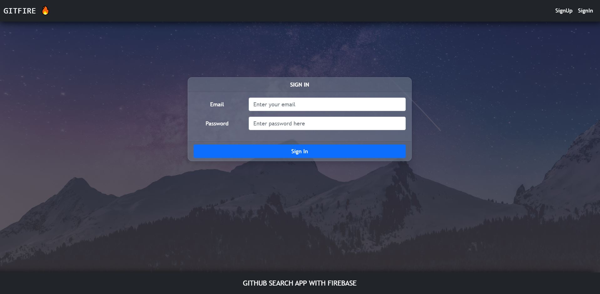
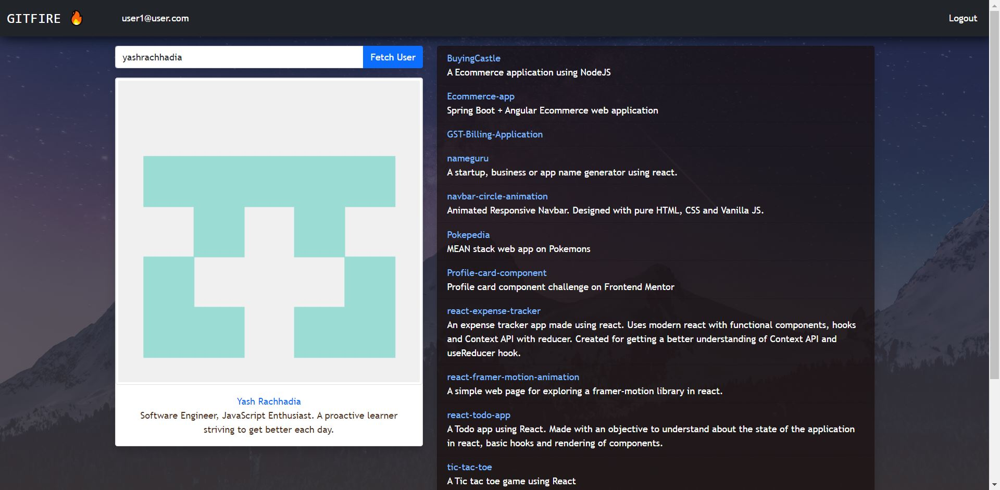

# Firebase Github App

- Built using React. Uses functional components, Context API, react router v6, reactstrap (React component library for Bootstrap), axios as a Http client, Firebase authentication and Github API.
- The app uses _firebase authentication (Email/Password authentication)_ for user **Sign In** and **Sign up**.
- Once logged in, the app allows to search for a github user using username and fetches the user profile and repositories information and displays in a well structured manner.
- Clicking on the repository name will open the searched user's github repository in a new tab.
- The app is also mobile responsive and renders well in all the devices.
- Built this in order to explore about firebase, using firebase authentication with react and learn more on changes in react router's version 6.

